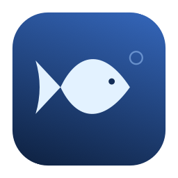
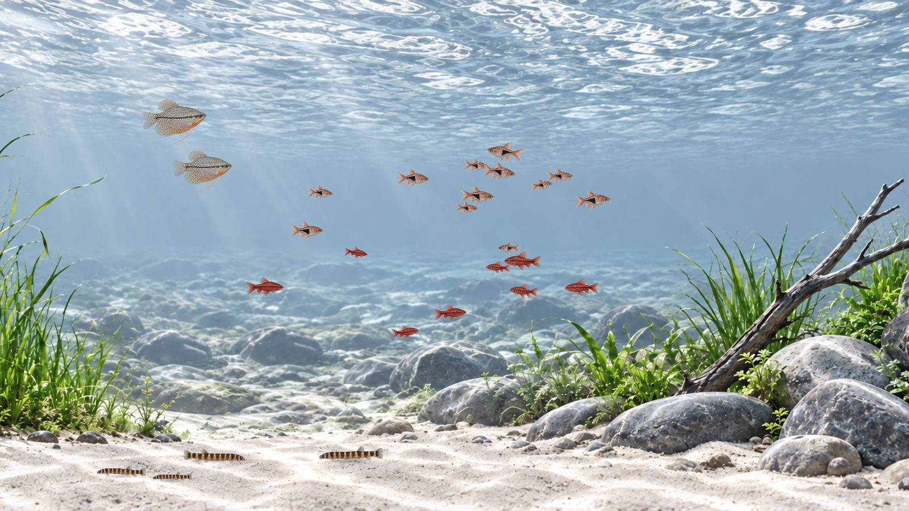
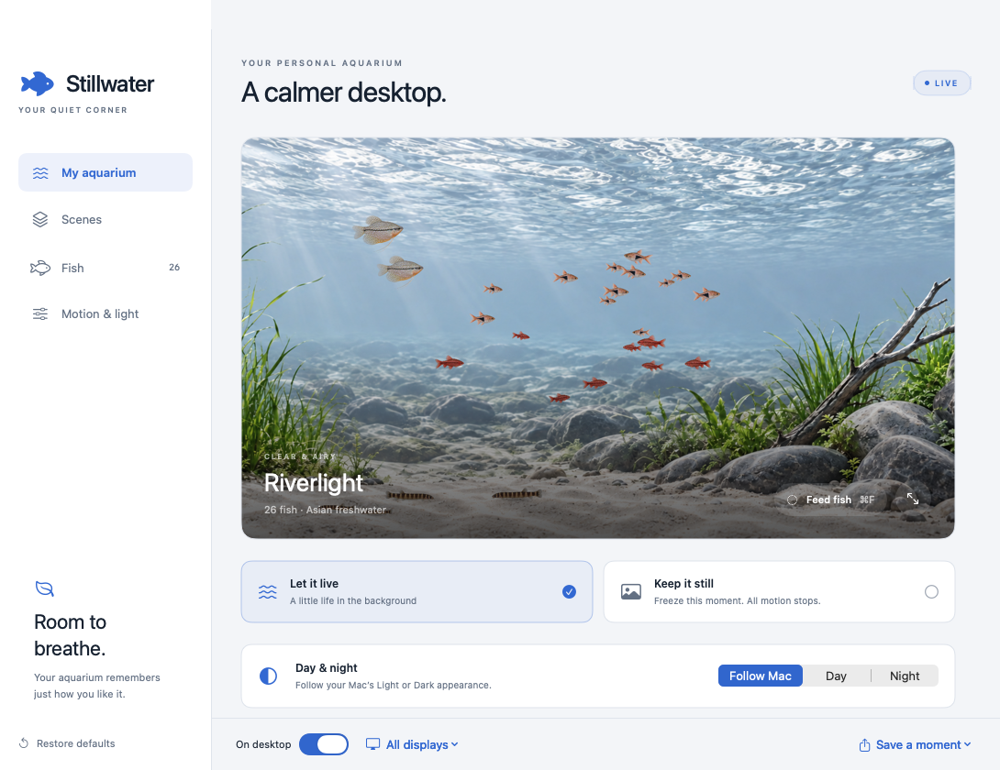
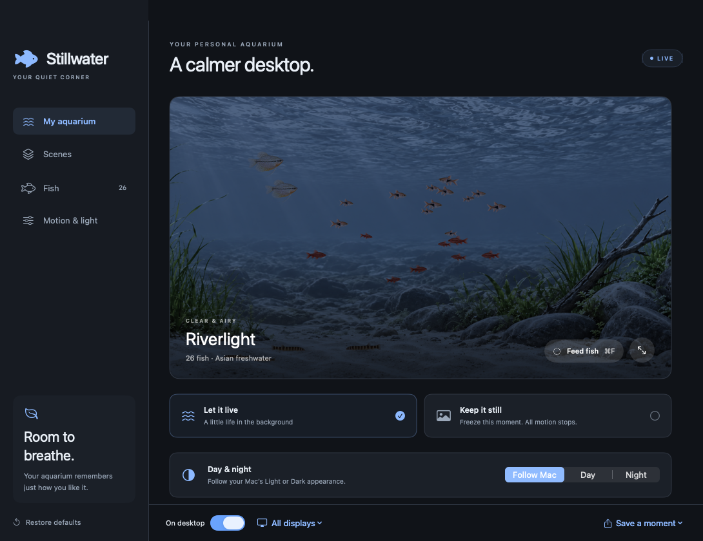
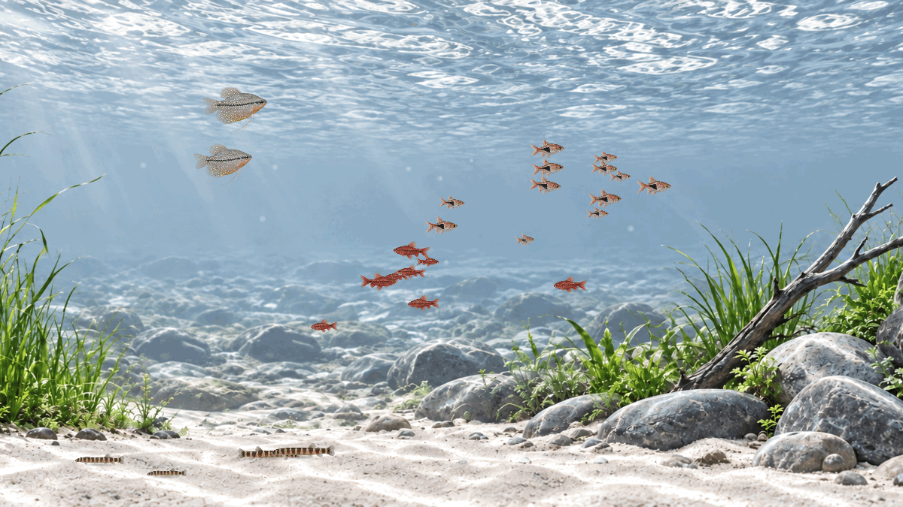
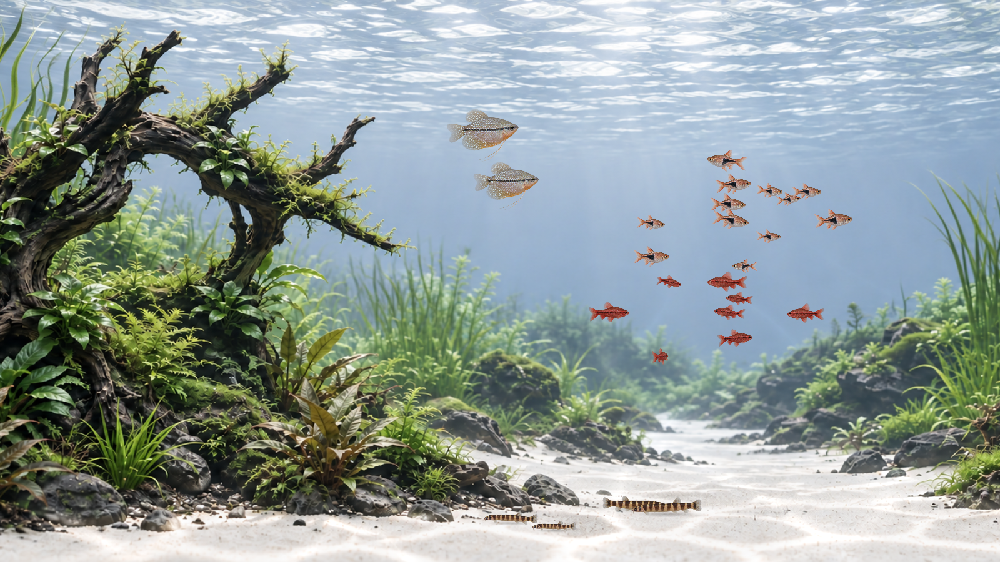
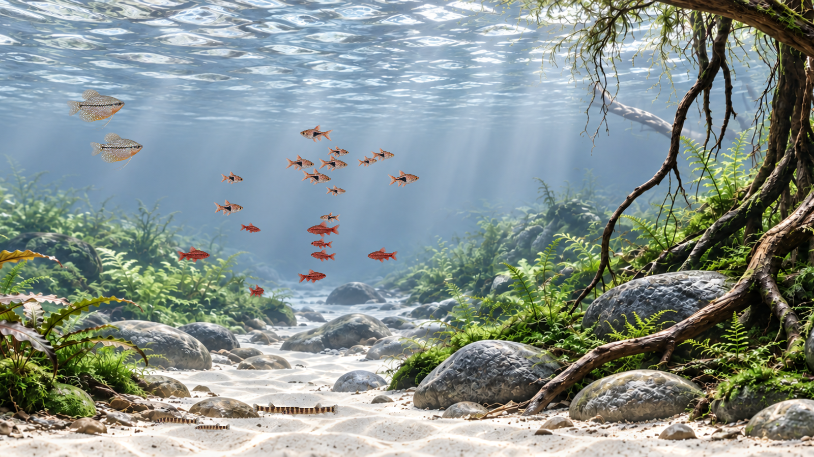

<div align="center">
  
  <h1>Stillwater</h1>
  <p>A quiet freshwater world for your Mac.</p>
  <p>
    <a href="https://github.com/xindomusic/stillwater/releases/latest"></a>
    <a href="LICENSE"></a>
    
    <a href="https://github.com/xindomusic/stillwater/actions/workflows/ci.yml"></a>
  </p>
  <p><a href="https://github.com/xindomusic/stillwater/releases/download/v1.0.1/Stillwater-1.0.1-macOS-arm64.dmg"><strong>Download for Mac · DMG</strong></a> &nbsp; · &nbsp; <a href="https://github.com/xindomusic/stillwater/releases/download/v1.0.1/Stillwater-1.0.1-macOS-arm64.zip">ZIP</a> &nbsp; · &nbsp; <a href="docs/INSTALL.md">Installation guide</a></p>
</div>



Stillwater turns your desktop into a planted freshwater aquarium. Fish swim, hover, explore, and react to food. Daylight fades into a softer night scene with your Mac’s appearance. Keep it alive in the background, or freeze a moment as a still wallpaper.

Native Swift, AppKit, SwiftUI, and SpriteKit. Everything is bundled locally. **No account, ads, subscriptions, analytics, or runtime downloads.**

## A little world, your way

| | |
| --- | --- |
| **Three original scenes** | Riverlight, Sunken Grove, and Willow Springs, with clear water, plants, sand, stones, and roots. |
| **Four freshwater species** | Harlequin rasboras, cherry barbs, pearl gouramis, and kuhli loaches. Set each population from 0–30. |
| **Responsive feeding** | Pellets enter in staggered sprinkles from changing locations. Fish notice, approach, nibble, and drift apart. |
| **Day and night** | Follow macOS Light/Dark appearance, including its automatic schedule, or choose Day or Night. |
| **Gentle atmosphere** | Leaf sway, rippling surface water, drifting light, optional particles, and glassy bubbles from changing sources. |
| **Your pace** | Swimming speed, brightness, and 15/30/60 fps options. Still mode freezes the scene and pauses rendering. |
| **Desktop friendly** | Lives behind desktop icons, ignores mouse clicks, and supports the main display or all displays. |
| **Keep a moment** | Export a display-resolution PNG or set it as a permanent macOS wallpaper. |

### Light or dark, naturally

| Day | Night |
| --- | --- |
|  |  |

The interface uses neutral surfaces and blue accents. Night lighting dims gradually while fish swim a little more slowly. Appearance changes also work in Still mode without moving the fish.

<details>
<summary><strong>Watch feeding and bubbles</strong></summary>



A short capture from the app’s renderer. The GIF is sampled at 15 fps; the app offers up to 60 fps.

</details>

<details>
<summary><strong>Explore the other scenes</strong></summary>



**Sunken Grove** — sculptural wood and planted edges around clear open water.



**Willow Springs** — delicate plants, pale sand, and sunlit roots.

</details>

## Install

1. Download the **DMG** or **ZIP** from [Releases](https://github.com/xindomusic/stillwater/releases/latest).
2. Copy **Stillwater.app** to Applications and open it.
3. Use the **fish icon in the menu bar** to reopen settings, feed your fish, or quit.

**Requirements:** Apple Silicon Mac (M1 or later), macOS 14 or later. The published binary is arm64. Local rendering was tested on an M4 with macOS 27; see [validation](VALIDATION.md) for coverage and limits.

**First launch:** v1.0.1 is ad-hoc signed and is **not Apple-notarized**. macOS may block the first launch. If you choose to trust this release, use **System Settings → Privacy & Security → Open Anyway** after attempting to open it. See the [installation guide](docs/INSTALL.md) and [Apple’s instructions](https://support.apple.com/guide/mac-help/mh40616/mac). SHA-256 checksums accompany the downloads.

Closing settings leaves the aquarium running. **Quit Stillwater** from the fish menu to reveal your underlying wallpaper. To launch at login, add Stillwater through macOS Login Items.

## Feed your fish

| Action | Shortcut |
| --- | --- |
| Feed while using any app | **Control–Option–Command–F** (`⌃⌥⌘F`) |
| Feed while Stillwater is active | **Command–F** (`⌘F`) |
| Open settings while Stillwater is active | **Command–comma** (`⌘,`) |

The **Feed fish** button and menu command do the same thing. Feeding requires Live mode, nonzero swimming speed, and at least one fish. Portions have a short cooldown and a limit to keep the water uncluttered. Disable the global shortcut in **Motion & light**; if another app owns the combination, the button and local shortcut remain available.

## Live, still, or saved

- **Live aquarium:** fish and water move while Stillwater runs.
- **Still image:** freezes fish, food, plants, and bubbles, and pauses the animation loop. Settings and appearance changes can still repaint the scene.
- **Set as macOS still wallpaper:** saves a fixed image that remains after quitting Stillwater. A saved PNG does not change with day/night appearance.

Your preferences persist between launches. Stillwater does not replace your underlying system wallpaper unless you choose **Set as macOS still wallpaper**.

## Build from source

Install Apple’s command-line developer tools or Xcode, then:

```sh
git clone https://github.com/xindomusic/stillwater.git
cd stillwater
zsh tools/test.sh
zsh tools/build.sh
open build/Stillwater.app
```

No third-party packages are required. Build scripts target Apple Silicon and macOS 14+. To create ZIP/DMG archives and checksums:

```sh
zsh tools/package.sh
```

See [development notes](docs/DEVELOPMENT.md), [contributing](CONTRIBUTING.md), and the [latest release notes](docs/releases/v1.0.1.md).

## How it works

Photographic-style scene plates and fish views are combined with shaders and a deterministic swimming simulation. Fish have independent moods, warped turns without overlapping images, and feeding responses; bubbles and pellets use separate particle behavior. This is a layered 2D aquarium, with the artistic and motion limits described in [development notes](docs/DEVELOPMENT.md).

All scene and fish artwork was generated for the project with OpenAI’s image generation tool. The app itself makes no AI or network calls. [Artwork credits and prompts](docs/ARTWORK.md) document the bundled assets.

## Privacy and storage

No tracking, accounts, or network services. Preferences live in the standard `com.stillwater.aquarium` preference domain. Permanent still exports live in `~/Library/Application Support/Stillwater/Stills/`; PNG exports go where you choose. The global shortcut registers only its specific key combination; it does not monitor other typing or request Accessibility access.

## License

[MIT](LICENSE) — source, documentation, and bundled project artwork. Made by [xindomusic](https://github.com/xindomusic).
